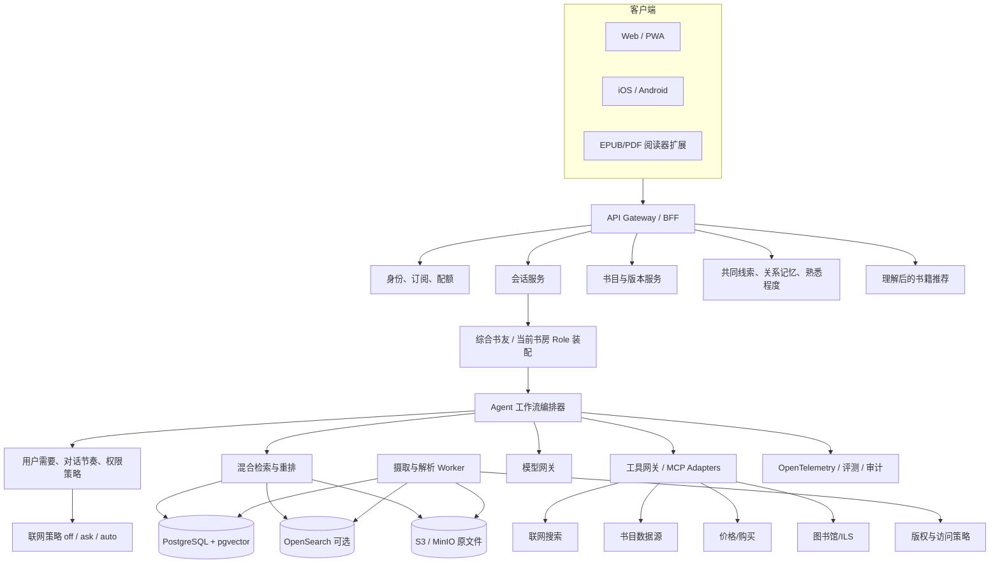
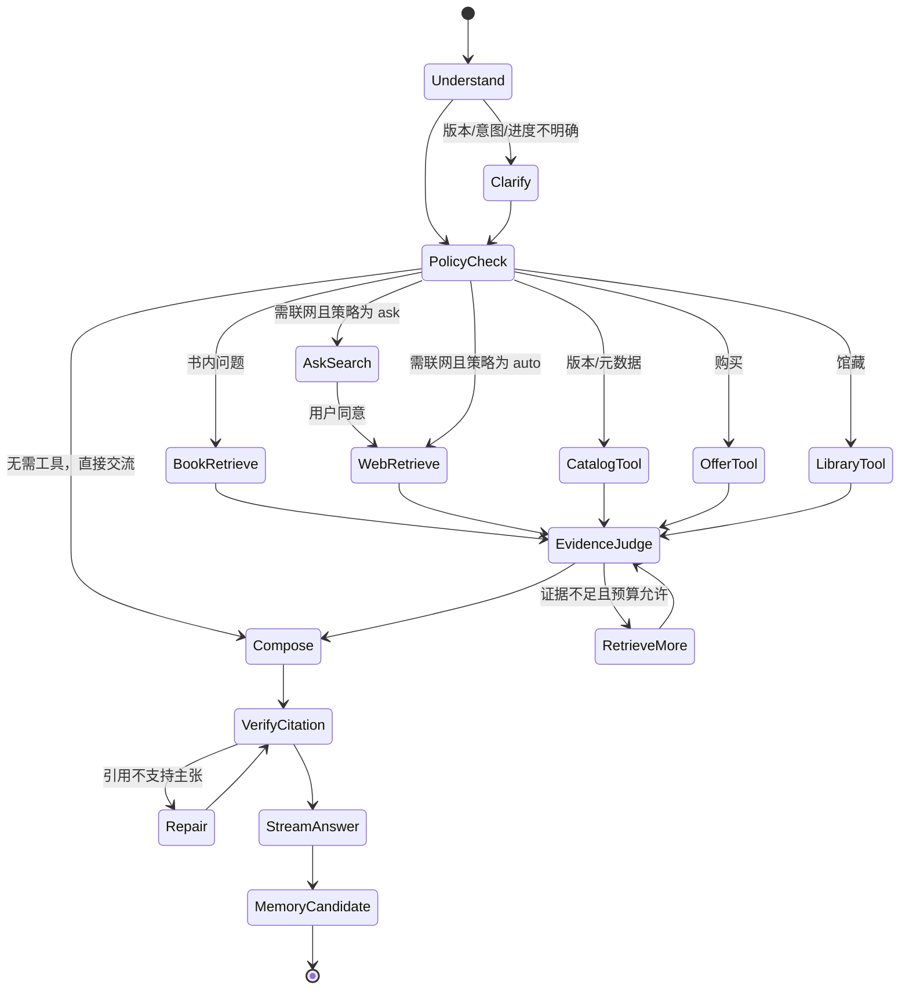

# AI 书友平台：产品、数据与技术方案

> 文档版本：v1.3（本地优先开源架构修订）  
> 编写日期：2026-08-17  
> 目标读者：创始团队、产品经理、技术负责人、开源贡献者、数据与版权合作方  
> 暂定项目代号：**BookMate / 书境**

---

## 0. 执行摘要

### 0.1 结论

这是一个有真实用户价值、适合做长期产品，也适合以开源方式建立生态的方向。它不应被定义为“把一本书切块后接一个聊天框”，而应从读者心里那句迟迟没有说完的话开始：

> **BookMate 让一本书在合上以后仍能继续发生。** 读者用自己的书、感受、分歧与未完问题，慢慢建立一位能长期接续交流的私人 AI 书友。泊舟先接住想法，再提供知识；能够共鸣，也敢于有依据地不同意。私人图书馆是双方共同的阅读现场，可靠的版本、检索与引用是信任底座，而持续交谈并共同形成新的理解，才是产品本身。

**v1.1 产品重心修订**：核心用户调整为已经读过或基本熟悉某本书、迫切想交流思想的人。未读导读、精细阅读进度和防剧透保留为辅助能力，不再主导首页和 MVP。书友的稳定身份、对话心流、关系记忆、有质量的不同意，以及理解用户之后的三路书籍推荐，提升为最高优先级。

**v1.2 架构修订**：用户选书后进入该书 Role 与单书记忆；未选书时由综合书友进行跨书交流。优先利用模型已有知识、关系记忆和长上下文，精确取证时才做书内检索；联网补充采用 `off/ask/auto`，默认先询问。官方网页面向普通用户并可闭源，开放部分调整为厂商中立 Agent Spec + MCP Server + Skills + 本地文件/记忆适配器，不随代码分发受限书籍数据。

**v1.3 本地优先修订**：开源版不再只是 Agent Kit，而是可以独立运行的 BookMate Local。默认采用单容器、单端口、SQLite 和本地文件目录；用户可以在网页中配置 Chat Completions 风格接口或 Responses 接口，上传自己的 TXT/Markdown/PDF/EPUB，并在不连接 BookMate 官方服务的情况下完成个人书友体验。PostgreSQL、Redis、向量数据库、全球馆藏和价格数据全部降为可选扩展。详细实现基线以《AI书友平台_本地优先开源架构方案》为准。

用户真正购买的不是 RAG，而是四种体验：

1. **我的思想被认真对待**：对方先听懂真正想说什么，再共鸣、追问或反驳，而不是泛泛总结。
2. **这是同一位有分寸的书友**：气质、节奏和面对分歧的方式稳定，同时透明承认 AI 身份。
3. **这段关系会成长**：记得双方讨论过的观点、分歧和开放问题，而不只是保存“喜欢哲学”等标签。
4. **需要考据时值得信任**：明确区分书中原文、外部评论、用户记忆和 AI 解释，证据可核验。

建议采用“双层产品”定位：

- **核心层：可信的私人 AI 书友**。这是留存、口碑和技术壁垒所在。
- **服务层：找书、比价、借阅和最新讨论工具**。这是获客、商业化与生态连接能力。

### 0.2 最重要的产品判断

| 判断 | 建议 |
|---|---|
| 第一批用户 | 已经读过或基本熟悉某本书、心里有话却找不到合适书友的深度读者 |
| 第一核心场景 | “这本书我读过，但这个想法一直没放下；我想找一位真正理解它也愿意理解我的书友” |
| MVP 内容来源 | 公版书 + 用户合法上传的私人 EPUB/PDF + 开放书目元数据 |
| MVP 对话 | 稳定书友身份 + 倾听/映照/张力/连接 + 单一主问题 + 用户可控关系记忆 |
| 双模式 | 选书后装配当前书 Role 和单书记忆；未选书时保持综合、跨书的个人书友 |
| MVP 上下文 | 优先模型已有知识、会话、记忆与长上下文；需要精确文本时才做书内取证 |
| Agent 形态 | 可审计的状态机/工作流，不采用完全自由规划的多 Agent 群 |
| 联网补充 | `off/ask/auto` 用户策略是最终权限；Agent 只判断搜索价值，默认 `ask` |
| 个性化推荐 | 根据已确认偏好和对话主题各给一本“延续、反面、跨越”，解释理由与不适配点 |
| 购买比价 | 从合法 API、联盟接口和深链开始，禁止页面爬价后冒充实时价格 |
| 附近馆藏 | 先做“附近图书馆 + 馆藏目录深链”，再逐馆接入实时可借状态 |
| 开源边界 | BookMate Local、Agent Spec、MCP、Skills、本地文件/记忆和评测开源；未来官方云服务可独立运营，授权数据不发布 |
| 商业模式 | 托管订阅 + 高级模型额度 + 机构版 + 合法联盟佣金；不出售私人阅读数据 |

### 0.3 这不是一个简单 RAG 项目的原因

这个项目首先是关系与思想交流产品，其次才是知识系统；但知识系统的错误会立即摧毁关系信任。一本“书”至少存在四种不同对象：抽象作品、不同语言/修订版、具体载体、某个图书馆或商家的可用副本。如果把《小王子》的英译本、法文原版和中文译本混成一个向量库，模型会生成看似合理但页码、措辞和译者均错误的引用。因此，**书友身份和心流决定用户是否留下，版本解析和版权边界决定这段关系是否值得信任**。

产品还必须同时处理：

- 作品与版本消歧；
- 稳定书友身份、关系连续性与不迎合的分歧能力；
- 对话节奏、认知负担和跨日重返；
- 用户要求无剧透时的阅读边界；
- 精确引用与可追溯定位；
- 版权、地域和用户上传内容的访问控制；
- 最新网页内容的时效性、可信度和注入攻击；
- 价格与馆藏的实时性和合作权限；
- 长期记忆中的隐私、错误记忆和用户可控性；
- 推荐的可解释性、探索性和商业利益隔离。

---

## 1. 用户与需求分析

### 1.1 核心用户画像

#### A. 读后思想交流者（核心）

- 已经读完或基本熟悉某本书；
- 某个人物、命题或感受持续留在心里；
- 身边很难找到读过同一本书、深度和节奏又合适的人；
- 想借书理解自己与现实，不满足于摘要或标准书评；
- 希望对方能共鸣，也能给出真正有质量的不同意见。

#### B. 深度阅读者

- 读文学、历史、哲学、社科或专业书；
- 经常有“想讨论，但身边没人正好读过”的孤独感；
- 需要观点碰撞，而不是标准答案；
- 对错误引用、空洞赞美和剧透非常敏感。

#### C. 阅读入门者（辅助）

- 想先判断一本书是否适合自己；
- 需要无剧透导读、难度说明、背景知识和版本建议；
- 可能进一步关心价格、电子版、附近馆藏和借阅方式。

#### D. 学习型读者

- 希望围绕一本教材或非虚构作品建立概念体系；
- 需要苏格拉底式追问、章节测验、知识卡片、跨书对比；
- 看重准确性、出处和复习效率。

#### E. 读书会与教育机构

- 希望为共读设置每周章节、讨论题和主持人；
- 既需要公共讨论空间，也需要每位成员的私人 AI 对话；
- 需要管理权限、内容安全和可导出的学习报告。

### 1.2 Jobs-to-be-Done

| 阶段 | 用户任务 | 平台应提供的能力 |
|---|---|---|
| 读后 | 我有一个想法一直没放下 | 先接住和映照，再用一个有张力的问题共同推进 |
| 读后 | 我不想被迎合 | 公平复述后提出最强反方，区分事实、解释和价值分歧 |
| 读后 | 我想借书谈现实中的自己 | 在用户授权的边界内连接生活，不擅自心理诊断 |
| 重返 | 我想接着上次未说完的地方 | 恢复双方确认的共同线索、分歧和开放问题 |
| 延伸 | 我想让懂我的书友推荐下一本 | 延续、反面、跨越三路可解释推荐 |
| 阅读中 | 我有一个观点想讨论 | 低成本询问熟悉程度；需要时才启用精细防剧透 |
| 读前 | 我是否应该读这本书 | 提供简洁无剧透引导，但不是核心留存流程 |
| 延伸 | 我想知道最近大家怎么谈它 | 带日期的联网检索、来源聚类、共识与分歧 |
| 行动 | 我想买或借这本书 | 版本对齐后的价格链接、附近图书馆和馆藏跳转 |
| 长期 | 我想看见自己的阅读成长 | 可编辑的阅读记忆、观点演变、跨书主题地图 |

### 1.3 用户最容易流失的时刻

1. 第一次对话就给出不存在的原文或错误页码；
2. 用户只读到第三章，AI 直接剧透结局；
3. 用户想交流，AI 却持续输出教科书式长篇总结；
4. 同一本书的不同译本被混用；
5. 标称“最低价”但链接失效、地区不符或价格过期；
6. “附近有馆藏”实际只是图书馆地址，无法证明书可借；
7. 长期记忆擅自记录敏感内容，或无法让用户查看和删除。

因此，首个版本要把“可信、不过度、可控”放在功能数量之前。

---

## 2. 产品定位与体验原则

### 2.1 一句话定位

**一个有身份、懂思想、会共同成长的个人 AI 书友。**

### 2.2 与通用聊天模型、摘要网站和读书社区的区别

| 能力 | 通用聊天模型 | 摘要/书评网站 | 传统读书社区 | 本平台 |
|---|---:|---:|---:|---:|
| 精确到用户版本的原文依据 | 弱 | 弱 | 不稳定 | 强 |
| 稳定书友身份与关系历史 | 弱 | 无 | 取决于真人 | 核心能力 |
| 有质量的共鸣与不同意 | 弱 | 无 | 不稳定 | 核心能力 |
| 阅读进度与防剧透 | 弱 | 弱 | 弱 | 辅助能力 |
| 持续、耐心的一对一讨论 | 中 | 无 | 取决于书友 | 强 |
| 最新外部讨论 | 中 | 中 | 强 | 强且带来源 |
| 长期阅读记忆 | 弱 | 无 | 部分 | 用户可控 |
| 买书与图书馆连接 | 弱 | 部分 | 部分 | 连接器化 |
| 人与真实书友的连接 | 无 | 无 | 强 | 后续增强 |

平台不应试图取代真实书友。更好的长期形态是：AI 负责随时陪伴、准备材料和降低匹配成本，真实读者负责不可替代的人生经验和关系。未来可基于“读过同一章节 + 讨论风格兼容 + 双方同意”推荐真人书友，但默认不公开私人对话。

### 2.3 八条体验原则

1. **先接住，后推进**：先准确理解用户真正想表达的东西，再选择共鸣、追问或反驳。
2. **证据与解释分层**：书中内容、外部资料、用户观点、AI 推断必须视觉区分。
3. **身份稳定但不伪装真人**：气质、节奏和分歧方式连贯，不虚构人类经历或情感。
4. **每轮只深半步**：默认一个主要问题，让用户保留表达空间，避免知识和长回答打断心流。
5. **记忆由用户拥有**：可查看、编辑、暂停、导出、删除；关系历史比偏好标签更重要。
6. **证据按需出现**：引用可点击回原位，但默认折叠，不让考据淹没交谈。
7. **进度按需启用**：用户要求无剧透时，进度成为检索权限；否则只询问粗粒度熟悉程度。
8. **不确定时明确说不知道**：没有可靠文本或实时数据时，不伪造引用、价格和可借状态。

---

## 3. 产品功能设计

### 3.1 共同书房（核心界面）

每本书对应一个“共同书房”，包含：

- 封面、作品与当前版本；
- 熟悉程度：读过一部分、基本读完、很熟悉；精细章节进度仅在无剧透需求下展开；
- 当前交流方向：顺着聊、较真一点、联系生活；
- 稳定书友身份、关系线索与尚未解决的共同问题；
- 对话区；
- 证据抽屉：书内引用、外部来源、来源时间、版本信息；
- 双方共同形成的观点、分歧、待验证想法和开放问题；
- 版本切换和页码映射提示。

推荐的首屏交互不是空白输入框或进度表，而是三个低压力入口：

- “有个想法一直没放下……”
- “我对这个人物有点不同看法”
- “这本书让我想到自己的生活”

### 3.2 核心是读后深聊，其他阶段作为辅助

#### 读后深聊模式（核心）

- 从用户未整理好的思想、情绪或现实连接进入；
- 一轮主要执行倾听、映照、聚焦、形成张力、证据、连接、开放或结束中的 1～2 个动作；
- 默认一个主要问题，回复长度匹配用户节奏；
- 允许用户选择“顺着聊、较真一点、联系生活”；
- 谈话结束时提议保存一个共同理解和一个开放问题；
- 数日后从用户确认的关系线索自然重返。

#### 读前模式（辅助）

- 严格无剧透介绍；
- 适读人群、不适读情形、难度和预估阅读投入；
- 主题、历史背景和必要前置知识；
- 不同译本、版本、装帧和电子/纸质差异；
- 价格与附近图书馆入口。

#### 共读模式（辅助）

- 进度锁定；
- 章节回顾、人物状态、概念解释；
- 围绕当前段落交流；
- 用户每次更新进度时生成一个可撤销的“阅读检查点”；
- 对任何可能引用后文的工具调用进行后端过滤。

### 3.3 稳定书友身份不是可随意换皮的人格

MVP 应先设计好一位稳定书友，而不是要求用户配置几十个性格参数。允许调节相处方式，但不建议模拟在世作者、名人或具体真人。身份应描述持久气质、思想诚意和关系边界，而不是冒充身份：

- 温和共情型：更多倾听和澄清；
- 苏格拉底型：少下结论，多追问假设；
- 批判型：主动寻找反例和文本冲突；
- 学术型：重背景、术语和来源；
- 简洁型：短答、少打断阅读节奏。

系统提示应约束“像一个好书友交流”，而不是固定输出模板。判断一次对话是否成功的指标应包括用户是否感到被准确理解、是否形成属于自己的新想法、是否愿意数日后回来，而不只是答案覆盖了多少知识点。

### 3.4 理解之后的书籍推荐

推荐不是热门榜单或简单“猜你喜欢”。当用户主动询问，或一次深度谈话自然结束后，系统可各提供一本：

- **延续**：继续当前思想线索；
- **反面**：挑战用户当前判断；
- **跨越**：从另一种体裁、文化或经验进入同一命题。

每本必须说明推荐依据、可能不适合之处和进入问题。推荐模型使用用户确认的偏好和关系记忆，不使用敏感推断；商业佣金不进入相关性排序。用户可删除推荐信号或要求“给我完全不同的东西”。

### 3.5 长期记忆

记忆分四层：

| 记忆层 | 示例 | 保存策略 |
|---|---|---|
| 会话工作记忆 | 当前问题、最近几轮引用 | 自动，随会话压缩 |
| 单书记忆 | 用户对人物的判断、未解问题 | 默认保存，可逐条编辑 |
| 阅读画像 | 喜欢的讨论方式、可接受剧透程度 | 明示同意后保存 |
| 跨书知识图谱 | 反复关注的主题、观点变化 | 用户开启后生成 |

禁止默认保存政治倾向、宗教、健康、性取向等敏感推断。系统只能记“用户明确表达且对未来阅读体验有帮助”的内容，记忆记录必须带来源会话和置信度。用户删除原会话时，应能级联删除由该会话提取的记忆。

### 3.6 最新讨论

用户可以问“最近一年大家如何评价这本书的新译本？”或“这本 20 年前的书放到今天还成立吗？”。处理流程应为：

1. 从作品和版本实体生成消歧查询；
2. 限定用户要求的语言、地区和时间；
3. 调用一个或多个合规搜索供应商；
4. 去重转载、聚类相同观点；
5. 对来源按原始性、作者身份、日期和相关度评分；
6. 抽取支持与反对证据；
7. 输出“共识、分歧、少数观点、尚无证据”，每项附链接和日期。

搜索结果是**不可信输入**。网页中的“忽略之前指令”等内容不得进入系统指令；网页只作为待引用资料。回答中必须显示“检索于 YYYY-MM-DD”，避免把旧讨论包装为最新情况。

### 3.7 购买与价格比较

价格比较的正确对象是“某个地区、某种货币、某个具体版本和商品状态下的报价”，而不是抽象作品。报价至少包含：

- ISBN/平台商品 ID；
- 地区、币种、纸书/电子书/有声书；
- 新书/二手；
- 标价、运费、税费可见性；
- 商家、联盟披露；
- 采集时间、预计过期时间；
- 原始购买链接。

MVP 不承诺“全网最低价”，只说“已接入渠道中的可见报价”。Google Books 的 Volume 资源可返回地区相关的 `saleInfo`、价格和 `buyLink`；Amazon 旧 PA-API 5 官方页面当前已标注弃用并迁往 Creators API。因此购买层必须使用可替换的 `OfferProvider`，不能硬编码某一家 API，更不能依赖网页抓取。

### 3.8 附近图书馆

需要严格区分三级结果：

1. **附近有图书馆**：只证明地理位置存在；
2. **该馆目录中有此版本或同作品其他版本**：证明有馆藏记录；
3. **当前可借/可预约**：需要实时流通系统或授权 API。

推荐交互：用户输入地址或授权一次性定位，选择搜索半径和纸书/电子书；平台先返回距离、开放时间和目录链接，再对已接入的馆显示“可借、已借出、可预约、仅馆内阅览”。未接入实时接口时必须展示“请在馆方页面确认”，不能推断可借状态。

全球不存在一个覆盖所有图书馆且完全开放的实时馆藏接口。可采用四级连接策略：

- OCLC WorldCat Search API：覆盖强，但官方说明通常要求相应的 OCLC Cataloging/Metadata 与 FirstSearch/WorldCat Discovery 订阅，商业使用需合作；
- OverDrive：官方提供 Metadata、Search、Library Availability、Holds、Checkouts 等 API，但需要申请凭据和合作权限；
- ILS 适配器：Koha、FOLIO、Alma、Sierra 等馆级系统的 REST 接口；
- 标准协议与深链：SRU/CQL、Z39.50 或图书馆 OPAC 搜索 URL，作为无法取得实时 API 时的降级方案。

---

## 4. 版本范围与路线图

### 4.1 MVP：证明“对话值得回来”（8～10 周）

必须有：

- 一位稳定、透明、有明确关系边界的默认书友；
- 从用户思想而非摘要进入的深聊界面；
- 倾听、映照、聚焦、张力、连接、结束等可评测对话动作；
- “顺着聊、较真一点、联系生活”三个轻量方向信号；
- 回复长度适配和一轮一个主要问题；
- 共同线索、关系记忆及查看/修改/删除；
- 数日后的自然重返；
- 搜索作品并选择正确版本；
- 公版书导入；
- 用户私人上传 EPUB/PDF；
- 按需书内检索、精确引用与折叠证据卡；
- 粗粒度熟悉程度；用户要求时才启用精细防剧透；
- 流式对话；
- 延续、反面、跨越三路可解释推荐；
- “被理解、有启发、太说教、过度迎合、事实有误”反馈；
- 心流对话和可信引用两套可复现评测集。

暂不做：

- 全网最低价承诺；
- 全球实时馆藏；
- 公开书评社区；
- 自主运行的多 Agent；
- 训练自有基础模型；
- 未获授权的版权书全文公共知识库。

### 4.2 Beta：验证增长与服务连接（再 6～8 周）

- 购买报价连接器与联盟披露；
- 地址搜索、附近图书馆和目录深链；
- 2～3 个示范馆/ILS 的实时馆藏连接；
- 跨书共同线索和用户可控阅读画像；
- 语音输入、体裁对话策略和最新讨论搜索；
- 中英文跨语言检索与译本对照；
- 分享不含版权原文的对话卡片；
- 读书会房间；
- Web + PWA，验证后再决定原生 App。

### 4.3 V1：平台化（3～6 个月）

- 连接器市场：书目、搜索、商家、图书馆、阅读器；
- MCP 兼容工具网关；
- 移动端系统分享、扫码 ISBN、相机 OCR；
- 机构 SSO、私有部署、审计日志；
- 基于授权内容的出版社/作者空间；
- 真人书友匹配，但采用双向同意和隐私保护。

---

## 5. 总体技术架构



### 5.1 架构原则

- **模块化单体优先**：MVP 先使用清晰模块边界，不为了“像大厂”提前拆几十个微服务。
- **异步摄取、同步对话**：解析/OCR/嵌入走任务队列；对话通过 SSE 流式返回。
- **供应商可替换**：模型、嵌入、reranker、联网搜索、商家和馆藏均通过接口适配。
- **双模式、同一身份**：基础书友身份稳定；Mode Role、当前书上下文和记忆作用域随是否选书切换。
- **上下文优先**：先使用模型知识、会话、记忆和缓存长上下文，精确取证时才启动检索。
- **搜索由用户授权**：意图路由只能建议，不能越过 `off/ask/auto`。
- **权限进入检索层**：不能只在生成后隐藏内容；向量和全文检索本身必须带租户、用户、版权、版本、进度过滤。
- **每个结论可追溯**：保存检索查询、候选片段、重排分数、工具结果摘要、模型版本和最终引用映射。
- **优雅降级**：联网搜索、价格或馆藏供应商不可用时，核心书内对话仍可工作。

### 5.2 推荐代码仓库结构

```text
bookmate-local/
├─ apps/
│  └─ web/                 # Next.js Web/PWA
├─ services/
│  └─ api/                 # FastAPI：业务 API、SQLite、模型网关
├─ packages/
│  └─ agent-kit/           # 可移植 Skills 与 provider 契约
├─ docs/                    # 产品、架构与运行规范
├─ data/                    # 本地运行数据，不纳入版本控制
├─ Dockerfile
└─ docker-compose.yml
```

推荐 Python 负责文档处理、检索和 Agent，TypeScript 负责 Web/移动端。API 契约由 OpenAPI 自动生成客户端，避免手工维护两套类型。

---

## 6. 书目与内容数据架构

### 6.1 核心实体模型

借鉴 IFLA LRM/FRBR 思路，但在产品层保持简单：

```text
Work（作品）
  └─ Edition（语言、译者、修订、出版社、出版年）
       └─ Manifestation（精装/平装/EPUB/PDF/有声书、ISBN）
            ├─ ContentAsset（合法可检索的文件）
            ├─ Offer（某地区、商家、时间点的报价）
            └─ Holding（某图书馆分馆的馆藏/可借状态）
```

关键点：

- ISBN 通常标识具体版本/载体，不能直接代表抽象作品；
- 一本书可能没有 ISBN，旧书可能只有 LCCN/OCLC/馆藏控制号；
- 同一电子书在不同平台有不同 ID；
- 标题和作者只能做候选召回，不能作为最终唯一键；
- 用户对话必须绑定 `edition_id`，找不到对应全文时要明确说明依据来自其他版本。

建议标识字段：ISBN-10/13、OCLC、Open Library Work/Edition ID、Google Volume ID、LCCN、DOI、Wikidata QID、出版社内部 ID。

### 6.2 数据源分层

| 数据源 | 主要用途 | 开放性/限制 | 推荐用法 |
|---|---|---|---|
| Open Library | Work/Edition、封面、作者、搜索、数据转储 | 开放，但需遵守使用政策与限流 | 基础书目候选和开放数据冷启动 |
| Google Books API | 全球书目、预览状态、地区价格、购买链接 | API Key/OAuth；结果随地区变化 | 补充元数据、预览和报价入口 |
| Library of Congress | 权威记录、LCCN、主题、数字馆藏 | 提供 JSON/YAML API | 权威名称、分类与历史资源 |
| Wikidata | 跨语言实体、作者、作品关系 | 数据为 CC0；SPARQL/REST/转储 | 实体对齐和知识图谱补全 |
| Crossref | DOI、学术书和章节元数据 | REST API，适合学术出版物 | 专著/章节/引用关系补充 |
| OpenAlex | 研究成果与引用网络 | 更偏学术世界 | 学术书及延伸论文发现 |
| Project Gutenberg | 公版电子书 | 依站点/镜像策略访问 | 公版内容种子库，保留版本来源 |
| Internet Archive | 数字化材料与元数据 | 内容权利与借阅状态各异 | 只摄取明确许可或公版内容 |
| OCLC WorldCat | 全球联合目录与馆藏 | 常需机构订阅或商业合作 | 馆藏高级连接器，不作为免费 MVP 前提 |
| OverDrive | 电子书发现、可用性、借阅 | 需申请 API 凭据/合作 | 合作后接入数字借阅 |
| 商家/联盟 API | 商品、价格、购买深链 | 地区、资格和展示条款严格 | 按商家做 OfferProvider |
| 用户上传 | 用户已拥有的 EPUB/PDF | 私有使用、权利声明、不可跨用户共享 | MVP 高价值内容来源 |

不要把豆瓣、Goodreads、亚马逊网页或出版社网页的非授权抓取当作核心基础设施。公开可访问不等于可批量复制、训练或商业再分发。

### 6.3 实体消歧与合并

采用“确定性规则 + 概率评分 + 人工修正”的三级方案：

1. ISBN/OCLC/LCCN 等强标识精确匹配；
2. 规范化标题、作者、语言、出版社、出版年、译者、页数计算候选分；
3. 对高相似但冲突的记录创建 `possible_match`，不自动合并；
4. 保存每个字段的来源和更新时间，而不是覆盖成一个“真值”；
5. 建立 canonical record，但允许字段级 provenance；
6. 用户可以报告“版本错误”，运营后台可拆分误合并实体。

示例评分可从以下权重起步：ISBN 1.0、作者 0.25、规范化标题 0.35、语言 0.15、译者 0.2、出版年邻近 0.1；具体阈值必须用真实标注集校准。

### 6.4 内容权利分级

| 权利等级 | 内容 | 可检索范围 | 可展示范围 |
|---|---|---|---|
| `public_domain` | 已确认公版 | 公共索引 | 依来源许可展示 |
| `open_license` | CC 等开放许可 | 按许可证 | 保留署名与许可证 |
| `user_private` | 用户合法上传 | 仅该用户/授权空间 | 仅私人会话、有限引用 |
| `partner_licensed` | 出版社/馆方授权 | 合同指定租户/地区 | 按合同限制 |
| `metadata_only` | 仅有书目 | 不索引全文 | 只展示元数据和外链 |
| `unknown` | 权利不清 | 禁止全文摄取 | 等待审核 |

版权策略必须在入库时确定，不能等模型回答后再补救。每个 chunk 都携带 `rights_scope`、`owner_tenant_id`、`region_allowlist`、`expires_at` 等 ACL 字段。

---

## 7. 文档摄取与索引

### 7.1 摄取流水线


每次摄取生成不可变 `ingestion_version`。新解析器上线时先创建新版本，验证后原子切换，避免半本书使用旧索引、半本书使用新索引。

### 7.2 解析策略

- EPUB：保留 spine、TOC、HTML 层级、脚注和 EPUB CFI；
- 数字 PDF：提取字符坐标、页号、段落和标题；
- 扫描 PDF：先判断是否需要 OCR，再做版面分析；
- 双栏、脚注、页眉页脚必须在质量检测中专项处理；
- 图片、图表和漫画可在授权范围内用多模态模型生成检索描述，但原图访问仍受 ACL 控制；
- 永远保留原文件哈希、解析器版本和文本到源位置的映射。

### 7.3 切块策略

不采用固定 500 token 粗切所有书。推荐：

- 先按章、节、段落和对话场景建立父子层级；
- 子块约 250～600 tokens，父块约 1,200～2,500 tokens，按体裁调参；
- 在检索时召回子块，在生成时补充其父节上下文；
- 戏剧按角色台词和场景切分，诗歌按诗/节，技术书按标题/代码块，漫画按页/格；
- 脚注与正文建立引用边，而不是混在正文中；
- 章节标题、人物/概念、时间地点作为结构化字段，不只写进嵌入文本；
- 不跨越用户当前阅读进度构造父上下文。

### 7.4 引用定位标准

优先使用稳定定位：

- EPUB：EPUB CFI + spine item + 段落文本指纹；
- PDF：页码 + bounding box + 文本指纹；
- 网页：URL + 标题 + 发布时间/访问时间 + 引用文本哈希；
- 扫描图：页码 + 区域坐标 + OCR 置信度。

可参考 W3C Web Annotation Data Model 表达 Target/Selector，EPUB 3.3/EPUB CFI 表达电子书位置。页码只能作为人类友好提示，因为不同版本页码并不稳定。

---

## 8. 上下文优先、按需检索与回答生成

### 8.1 Context-first, retrieval-when-needed

用户选择书籍后，不应默认每轮执行 RAG。对于模型熟悉的作品和思想问题，优先使用：

1. 稳定基础书友身份；
2. 当前书房 Role 或综合书友 Role；
3. 本轮会话和共同线索；
4. 用户确认的全局与单书记忆；
5. 模型已有知识；
6. 已缓存的用户文件/合法长上下文。

只有精确原句、冷门/新书、具体版本、跨章节证据或上下文预算不足时才启动书内取证。联网搜索与书内取证是两种不同权限：书内读取可以在选书后默认使用，联网必须服从用户的 `off/ask/auto`。

依据状态分四级：仅模型已有知识、用户摘录、已读入当前版本、已联网补充。模型已有知识足以支持许多讨论，但不能冒充拥有用户手中的具体版本。

### 8.2 需要取证时为什么采用混合检索

书籍提问同时包含：

- 精确词句：“那句关于凝视深渊的话在哪里？”；
- 语义问题：“主人公为什么突然疏远朋友？”；
- 结构问题：“前三章如何逐步建立不可靠叙述？”；
- 跨语言问题：“这个中文译法对应原文什么概念？”；
- 外部新问题：“2026 年有哪些评论重新讨论这个观点？”

仅向量检索会漏掉专名、数字和原句；仅关键词检索又无法处理隐喻和同义表达。因此使用：

`候选 = BM25/全文检索 ∪ 向量检索 ∪ 结构/实体检索`

再用跨编码器 reranker 或轻量生成式评分器重排。MVP 可在 PostgreSQL 中组合全文检索与 pgvector；数据量、语言分析和查询吞吐达到阈值后，再把稀疏/混合部分迁至 OpenSearch。不要为了架构时髦在第一天引入两个真相源。

### 8.3 查询路由

每次输入先生成结构化 `QueryPlan`：

```json
{
  "mode": "book_room",
  "intent": "discuss_passage",
  "answer_mode": "critical_friend",
  "book_scope": ["edition_123"],
  "progress_limit": {"chapter": 7, "position": 0.42},
  "context_sources": ["model_knowledge", "book_memory"],
  "needs_book_retrieval": false,
  "needs_web_search": false,
  "web_search_value": "low",
  "search_policy": "ask",
  "needs_catalog": false,
  "needs_offer": false,
  "needs_library": false,
  "citation_required": true,
  "sensitivity": "normal"
}
```

分类失败时采用最小权限：使用当前模式允许的会话和记忆，必要时只读取当前书上下文，绝不自动联网或读取不相关的单书记忆。

### 8.4 书内取证步骤

1. 查询改写：保留专名和原句，生成 1～3 个互补查询，禁止无限扩展；
2. ACL 过滤：用户、租户、权利、地区、版本；
3. 剧透过滤：`chunk_end_position <= user_progress`；
4. 混合召回：稀疏、向量、章节/实体；
5. 结果融合：RRF 或经校准的加权融合；
6. 重排：问题—片段相关性、版本一致性、进度安全性；
7. 上下文扩展：加入父节、脚注或相邻段，但再次检查进度；
8. 去冗余：避免十个片段都来自同一段；
9. 证据充分性判断：不足则追问、联网或拒答；
10. 生成后做引用蕴含检查，确保引用确实支持相邻主张。

### 8.5 防剧透是后端安全策略

仅在 prompt 中写“不要剧透”不可靠。系统需实施：

- chunk 带连续 `narrative_position`；
- 检索 SQL/索引 filter 硬限制进度；
- 人物状态和章节摘要按检查点生成，不能使用全书摘要截断；
- 联网查询加无剧透约束，但因搜索摘要仍可能剧透，默认不在共读模式自动联网；
- 对回答做角色名、事件实体和未来章节证据检测；
- 用户主动要求后文时二次确认并记录临时授权。

### 8.6 证据分层输出

回答中的事实划分为：

- `BOOK_TEXT`：当前版本文本直接支持；
- `BOOK_METADATA`：作者、版本、出版信息；
- `EXTERNAL_SOURCE`：网页、论文、采访或评论；
- `USER_MEMORY`：用户过去明确表达；
- `MODEL_INTERPRETATION`：AI 的分析或推断。

前四类应可点击查看来源；第五类必须使用“我的理解是”“一种可能的解释”等语言，而不能伪装为原文事实。

### 8.7 GraphRAG 的适用边界

知识图谱适合：

- 长篇系列的人物关系、地点、事件和时间线；
- 非虚构书的概念、论点、证据和反驳关系；
- 跨书主题、作者和引用网络。

但不建议 MVP 对每本书都运行昂贵的全自动 GraphRAG。先对高价值字段做实体抽取并保留证据，只有当普通混合检索在“全局结构问题”上明显不足时，才构建章节级社区摘要或图遍历。任何图节点都要回链到原始片段，不能让模型生成的关系成为无来源的事实。

### 8.8 长上下文的使用

长上下文可以在短书、单章复盘和候选证据合成时减少切块损失，但不替代检索：

- 成本和延迟随上下文增长；
- 全书中间位置的信息可能被忽略；
- 权限和剧透边界更难控制；
- 精确引用仍需稳定位置映射。

推荐优先复用可缓存的书籍长上下文；当整书重复发送成本过高、精确定位困难或上下文不足时，再通过检索缩小范围并扩大到必要章节。长上下文与检索是按任务组合，不是路线之争。

---

## 9. Agent 工作流设计

### 9.1 Agent 的定义

本项目的 Agent 是一个有状态、可暂停、可审计的工作流，不是让模型随意循环调用工具。核心图如下：

Agent 分两级：每轮运行轻量结构化路由；只有最新事实、找书、精确取证、价格和馆藏等多步任务才进入受限 ReAct。读后感、人物解释、反方观点和生活连接通常直接交流，避免工具调用破坏心流。



联网策略：

- `off`：Agent 不得调用网页搜索，只能说明信息可能过时或无法确认；
- `ask`：搜索能显著改善回答时先解释原因并询问，推荐默认；
- `auto`：仅在明确的动态事实和外部服务意图中自动调用，并展示来源；
- 用户开关是硬权限，Agent 的意图识别不能覆盖它；
- 本地书籍文件、单书记忆和用户摘录不属于联网搜索。

### 9.2 工具接口

内部先定义稳定领域接口，再决定是否暴露为 MCP：

```python
class CatalogProvider(Protocol):
    async def search(self, query, locale, cursor=None) -> BookPage: ...
    async def resolve(self, identifiers) -> EditionCandidates: ...

class SearchProvider(Protocol):
    async def search(self, query, time_range, locale, domains=None) -> SearchPage: ...

class OfferProvider(Protocol):
    async def offers(self, edition_id, region, currency) -> list[Offer]: ...

class LibraryProvider(Protocol):
    async def nearby(self, edition_id, location, radius_km) -> list[Holding]: ...
```

MCP 适合第三方连接器生态和本地工具互操作，但不能替代内部鉴权、配额、审计和领域模型。每个工具应声明数据新鲜度、地区、成本、超时、是否需要用户确认以及返回结果的可信级别。

### 9.3 工具安全

- 搜索、书目查询属于只读工具，可在用户意图明确时自动调用；
- 精确定位属于敏感个人数据，先征得同意，只保存模糊位置或地址哈希/短期 token；
- 购买只生成链接，不代表用户下单；
- 借阅、预约和结算属于外部写操作，必须二次确认；
- 工具输出采用 JSON Schema 验证，拒绝额外指令字段；
- 设置单轮最大工具次数、总时延和费用预算；
- URL 抓取经过 SSRF 防护、域名策略、内容大小限制和恶意文件扫描。

### 9.4 模型策略

不要把某个具体模型名写死到业务逻辑。定义能力层级：

| 任务 | 模型需求 | 路由建议 |
|---|---|---|
| 意图/路由/查询改写 | 低延迟、结构化输出稳定 | 小模型 |
| 嵌入 | 中英多语言、长文本、可自托管备选 | 独立 embedding provider |
| 重排 | 跨编码器、多语言 | 专用 reranker |
| 深度书友对话 | 推理、文风、长上下文、引用遵循 | 高质量生成模型 |
| OCR/页面理解 | 视觉、版面、表格 | 多模态模型或专用 OCR |
| 记忆抽取 | 精确、保守、结构化 | 小/中模型 + 规则 |

模型网关记录 provider、model、版本、区域、输入输出 token、缓存命中、延迟和成本。上线新模型时先在固定评测集 shadow test，再按租户或百分比灰度。

当前主流供应商均在强化“联网 grounding、文件检索、结构化工具调用和引用”；Google Gemini 官方文档已提供 Google Search grounding 和 File Search，OpenAI 官方文档也提供 Responses/工具相关入口。为了避免区域可用性、价格和接口变化影响产品，平台只依赖自己的 `ModelGateway` 和证据协议，不把供应商原生向量库作为唯一数据源。

---

## 10. API 与事件设计

### 10.1 核心 API

```text
GET    /v1/books/search?q=&locale=&cursor=
GET    /v1/works/{work_id}
GET    /v1/editions/{edition_id}
POST   /v1/assets/uploads
GET    /v1/assets/{asset_id}/ingestion-status

POST   /v1/reading-rooms
PATCH  /v1/reading-rooms/{room_id}/progress
POST   /v1/conversations/{conversation_id}/messages
GET    /v1/conversations/{conversation_id}/events   # SSE

GET    /v1/editions/{edition_id}/offers?region=&currency=
POST   /v1/editions/{edition_id}/nearby-holdings

GET    /v1/memories
PATCH  /v1/memories/{memory_id}
DELETE /v1/memories/{memory_id}
POST   /v1/privacy/export
DELETE /v1/account
```

### 10.2 对话事件

SSE 事件建议包括：

- `message.accepted`：消息已接收；
- `plan.ready`：可展示“正在查书内内容/最新讨论”，不暴露私有思维链；
- `citation.ready`：证据卡片可先出现；
- `answer.delta`：文本流；
- `answer.completed`：结构化答案与 token/时延元数据；
- `memory.proposed`：可选的记忆候选；
- `error.recoverable`：某工具失败但可降级；
- `error.terminal`：无法继续。

客户端不得依赖模型原始流格式，由后端统一转换为领域事件。

### 10.3 回答对象

```json
{
  "answer_id": "ans_...",
  "text": "……",
  "claims": [
    {
      "claim_id": "c1",
      "span": [0, 36],
      "kind": "BOOK_TEXT",
      "citations": ["cit_1"],
      "confidence": 0.91
    }
  ],
  "citations": [
    {
      "id": "cit_1",
      "edition_id": "ed_...",
      "chapter": "第七章",
      "locator": {"type": "epub_cfi", "value": "epubcfi(...)"},
      "quote": "……",
      "rights": {"display": "short_excerpt"}
    }
  ],
  "retrieved_at": "2026-08-17T08:00:00Z",
  "spoiler_boundary": {"chapter": 7, "position": 0.42}
}
```

---

## 11. 数据库设计

### 11.1 主要表

```text
users, organizations, memberships, consents
works, contributors, work_contributors
editions, manifestations, identifiers, source_records
content_assets, ingestion_versions, chapters, chunks, chunk_embeddings
reading_rooms, reading_progress_events, annotations
conversations, messages, answer_claims, citations
memories, memory_sources, memory_consents
search_runs, tool_calls, model_runs, feedback
offer_snapshots, merchants
libraries, branches, catalog_connectors, holding_snapshots
rights_policies, access_grants, takedown_cases
```

### 11.2 多租户与向量权限

- 所有私人数据表含 `tenant_id` 和 `owner_user_id`；
- PostgreSQL 使用 Row Level Security 作为第二道防线；
- 向量查询必须在同一 SQL/检索请求中应用 ACL，不允许先召回再由应用层剔除；
- 公共、公版、合作方和用户私人索引逻辑隔离；
- 删除用户内容时同步删除原文件、文本、向量、缓存、派生摘要和记忆；
- 备份中的删除按数据保留政策异步到期，并在隐私说明中写清。

### 11.3 缓存与新鲜度

| 数据 | 建议 TTL | 说明 |
|---|---:|---|
| 基础书目 | 7～30 天 | 字段级保留来源和更新时间 |
| 搜索结果 | 15 分钟～24 小时 | 依“最新”敏感度 |
| 商家报价 | 15 分钟～6 小时 | 展示采集时间，不保证结算价 |
| 馆藏记录 | 1～24 小时 | 目录存在性 |
| 实时可借状态 | 1～10 分钟 | 以馆方能力为准 |
| 书内检索结果 | 可长缓存 | key 必须包含索引版本和进度边界 |

---

## 12. 推荐技术栈

### 12.1 MVP 默认选择

| 层 | 推荐 | 理由 |
|---|---|---|
| Web/PWA | Next.js + React + TypeScript | SEO、分享页、服务端渲染和生态成熟 |
| 移动端 | Expo React Native（Beta） | 复用 TypeScript，支持扫码、分享和推送 |
| API | FastAPI + Pydantic | Python RAG 生态、类型化契约、异步接口 |
| 工作流 | LangGraph 或自建轻量状态机 | 显式状态、检查点、人工确认；封装避免框架锁定 |
| 数据库 | PostgreSQL | 事务、JSONB、全文检索、RLS |
| 向量 | pgvector | MVP 运维简单，向量与 ACL 同库 |
| 搜索扩展 | OpenSearch | 数据/吞吐增长后增强多语言 BM25 与混合搜索 |
| 缓存/队列 | Redis + Dramatiq/Celery | 初期任务和限流；复杂长流程再评估 Temporal |
| 对象存储 | S3 / MinIO | 原文件、解析产物和导出包 |
| 解析 | ebooklib + PyMuPDF + Docling/同类工具 | EPUB、数字 PDF、结构恢复 |
| OCR | PaddleOCR/商业 OCR 适配层 | 中文和扫描材料；按质量路由 |
| 可观测性 | OpenTelemetry + Prometheus + Grafana + Sentry | 统一 trace、指标和错误 |
| 部署 | Docker Compose + Kubernetes 可选 | 本地贡献简单，机构部署可扩展 |

### 12.2 何时升级组件

- PostgreSQL 检索 P95 超过目标且优化/分区无效，再引入 OpenSearch；
- 任务需要跨天等待、人工审批、复杂重试，再引入 Temporal；
- 单体部署阻碍独立扩缩容或团队交付，再拆服务；
- 只有在真实查询证明图遍历有收益时，才增加图数据库；
- 只有在成本、隐私或延迟有明确收益时，才部署自托管模型。

---

## 13. 评测体系

### 13.1 离线评测集

至少建立 300～500 条中英文测试，覆盖：

- 原句查找；
- 单段解释；
- 跨章节综合；
- 版本/译本消歧；
- 已读边界内问题；
- 诱导剧透问题；
- 书中没有答案的问题；
- 最新网页讨论；
- 错误 ISBN、同名书和同名作者；
- 恶意网页 prompt injection；
- 私人文件跨用户越权尝试；
- 价格过期和馆藏不可用降级。

每条样本保存：用户版本、进度、期望证据、允许的回答要点、禁止内容、是否应联网/追问/拒答。

### 13.2 指标

#### 检索

- Recall@K、MRR/nDCG；
- 正确版本命中率；
- 引用位置精度；
- 进度过滤泄漏率（目标必须接近 0）；
- 多语言查询召回差异。

#### 回答

- claim-level citation precision/recall；
- 引用对主张的蕴含率；
- 无依据主张率；
- 剧透率；
- 有证据不足时的正确拒答率；
- 用户风格遵循度；
- 真实读者对“愿不愿继续聊”的盲评。

#### 系统

- 首 token 延迟、完整回答 P50/P95；
- 单轮成本；
- 工具成功率与降级率；
- 摄取成功率/OCR 低置信页比例；
- 隐私删除完成时间。

### 13.3 线上实验

不要只优化点赞率。核心北极星指标建议为：

> **每周完成至少一次“用户愿意主动延续、且自评更清晰或被理解”的深度对话用户数。**

“深度对话”可定义为：同一共同书房内至少 4 个有效来回，或用户主动表达一段完整观点；用户选择“被理解”或“有启发”之一，且没有事实错误、隐私越权或关系安全问题。辅助指标包括第 3/5/8 轮自然延续率、7 日主动续聊率、共同记忆接受/修正率、过度迎合率和说教反馈率。引用打开率只作为可信能力指标，不强迫每次思想交流都打开证据。

不把总停留时长、消息数量、连续签到或“心流分数”作为单独成功指标，避免把深度关系优化成依赖和成瘾。

LLM-as-judge 只能作为回归筛选，必须使用不同模型/规则与人工抽检校准，避免模型给模型自我打高分。

---

## 14. 安全、隐私与版权

### 14.1 威胁模型

- 用户上传恶意 PDF、压缩炸弹或脚本；
- 网页检索结果包含提示注入；
- 私人向量被其他用户召回；
- 模型输出大段受版权保护文本；
- 通过连续提问重建整本书；
- 地址、阅读记录和敏感观点被滥用；
- 第三方工具密钥泄漏；
- 商家/馆藏数据过期导致误导；
- 分享链接泄露私人会话。

### 14.2 防护措施

- 上传文件隔离扫描、大小/页数限制、解析器沙箱；
- URL 访问通过 egress proxy、SSRF 防护和内容类型白名单；
- 租户隔离、RLS、向量 ACL、最小权限服务账号；
- 密钥放 Secret Manager，不进入日志和 prompt；
- 对长篇版权文本实施片段长度、累计引用和会话级防重建策略；
- 外部来源文本与系统指令物理分隔；
- 精确地址只用于当前查询，优先转换为低精度 geohash 后删除原值；
- 分享默认只包含用户选择的内容，自动去除位置、私人记忆和大段原文；
- 提供 DMCA/权利人通知、下架、申诉和审计流程；
- 明确“阅读建议/解释不等同于专业法律、医疗或投资意见”。

### 14.3 版权产品策略

1. 不建立未经授权的畅销书全文公共库；
2. 公版判断按作品、译本、插图、地区分别进行，不能只看原作者逝世年份；
3. 用户上传前确认拥有访问权，内容默认私有且不用于训练；
4. 输出短引用并回到合法来源，不提供可替代购买整书的大段连续文本；
5. 与出版社合作时用细粒度合同表达地区、期限、展示长度、模型用途和可导出性；
6. 开源仓库只提供导入工具和示例公版数据，不发布受限语料。

具体上线地区需由当地律师复核著作权、消费者保护、隐私和联盟营销规则。本方案是工程与产品建议，不构成法律意见。

---

## 15. 可观测性、成本与 SLO

### 15.1 端到端 Trace

一次回答生成同一个 `trace_id`，记录：

- 匿名化的请求属性和意图；
- 进度/版本过滤条件；
- 检索查询、候选 ID 和分数；
- 工具名称、耗时、缓存、错误与费用；
- 模型、提示版本、token 和停止原因；
- 主张—引用映射和验证结果；
- 用户反馈。

生产日志默认不记录完整私人原文、会话和地址。调试采样需脱敏、限制人员权限并设置短保留期。

### 15.2 MVP SLO 建议

| 指标 | 目标 |
|---|---:|
| API 月可用性 | 99.5% |
| 首 token P95 | < 3 秒（无需联网）；< 6 秒（联网） |
| 完整回答 P95 | < 15 秒（无需联网）；< 30 秒（联网） |
| 核心书内检索成功率 | > 99% |
| 私人数据越权 | 0 |
| 严格模式剧透泄漏 | 0 容忍，逐案复盘 |

### 15.3 成本控制

- 查询路由和记忆抽取使用小模型；
- 缓存书目、嵌入、章节摘要和稳定搜索结果；
- 仅在证据不足时做第二轮检索；
- 控制候选 K、rerank 数量和最终上下文；
- 同一内容按规范化哈希去重嵌入，但 ACL 不合并；
- 免费用户限制联网、OCR 和高质量模型额度，而不是降低引用准确性；
- 建立每个 `tenant/user/feature/provider` 的成本账本和熔断器；
- 支持自带模型 Key 作为高级开源部署选项，但仍通过网关审计。

---

## 16. 开源与商业化

### 16.1 项目形态：闭源托管产品 + 开源 Agent Kit

普通读者需要无需理解模型、MCP、Docker 的网页/PWA，官方托管产品可以闭源。开发者和高级用户需要的是可在自己宿主、模型和本地文件上运行的开放能力。对外不宜再笼统宣称“整个平台开源”，而应明确：

> 官方网页是商业托管产品；BookMate Agent Kit 是独立可用的开源项目。

MCP/Skills 主要解决开发者集成和跨宿主兼容，不能替代普通用户网页。开源真实性的验收标准是：不连接官方服务器，用户仍能通过自己的模型、本地书籍和 SQLite 记忆获得基础双模式书友体验。

### 16.2 推荐开源边界

开源：

- 厂商中立 `bookmate-agent-spec`：基础身份、双模式、搜索策略和响应协议；
- MCP Server：选书、当前书上下文、全局/单书记忆、推荐和受控搜索工具；
- Codex Skill 与通用 instructions，后续按宿主增加适配包；
- 本地 EPUB/PDF、SQLite 和开放元数据连接器；
- 自带模型 Key 的基础网关；
- 公版书示例、角色一致性、搜索路由和记忆隔离评测；
- 连接器 SDK、Quick Start 和本地运行示例。

不随仓库发布：

- 官方网页前端和托管运营控制面（可以闭源）；
- 受版权保护的书籍全文；
- 商业书目/馆藏数据转储；
- API 密钥与联盟账户；
- 用户对话和阅读画像；
- 合作合同限定的模型与数据；
- 真实用户反馈、对话和高级线上评测数据。

MCP 负责数据、资源和结构化工具；Skill 负责如何切换 Role、何时调用工具和如何保持书友行为；Agent Spec 是两者共同遵循、避免厂商锁定的源规范。不能只发布 MCP 后声称已经完整开放书友人格，也不能只发布一个 Skill 而没有可独立使用的数据和记忆能力。

### 16.3 许可证建议

- Agent Spec、MCP、Skills 和连接器 SDK 建议 Apache-2.0，最大化宿主集成；
- 官方网页、托管编排、高级运营能力可以保持商业许可；
- 文档/公版评测数据单独声明 CC BY 4.0 或 CC0，第三方元数据保留各自许可。

建议采用 Apache-2.0 + 商标政策 + DCO。不要使用“源码可见但限制使用”的许可证却宣传为开源。许可证选择需在第一次外部贡献前确定。

### 16.4 商业模式

- 免费层：有限书库/上传空间、基础模型和每日对话；
- Pro：更强模型、更多 OCR/联网额度、跨书记忆和导出；
- 读书会：多人房间、主持工具和共读计划；
- 机构版：学校/图书馆/出版社 SSO、私有内容、审计和 SLA；
- 出版合作：正版试读、作者问答空间、授权知识库；
- 联盟佣金：购买链接透明披露，不影响排序或明确标记赞助。

平台不应出售阅读画像或用私人上传内容训练公共模型。这既是信任底线，也可形成品牌差异。

数据采用 BYOB（Bring Your Own Book）和连接器策略：开源代码提供协议、读取器、开放元数据和公版样例；用户或合作方提供合法内容。托管网页的商业价值来自零配置体验、跨设备同步、模型代付与路由、合法授权数据、语音移动端、安全运营和更成熟的 Role/评测，而不是故意让开源版无法使用。

---

## 17. 团队、计划与交付物

### 17.1 最小团队

- 1 名产品/创始人：读者研究、内容合作、路线决策；
- 1 名全栈前端：Web/PWA、阅读器、流式体验；
- 1～2 名后端/AI 工程师：摄取、检索、工作流、评测；
- 0.5 名设计：阅读体验、证据和剧透交互；
- 兼职数据/版权顾问；
- Beta 前增加社区/内容运营。

### 17.2 12 周实施建议

#### 第 1～2 周：风险验证

- 访谈 15～20 名重度读者；
- 验证综合书友/当前书房双模式和一个稳定基础身份；
- 选择 10 本用户已读作品，比较模型直接交流、长上下文和按需取证；
- 建立首批 100 条金标问题；
- 标注哪些问题无需搜索、哪些需书内上下文、哪些需联网；
- 确定版权和隐私政策草案。

**退出条件**：至少 60% 目标用户认为“双模式 + 关系记忆 + 搜索克制”的持续交流明显优于自己直接使用通用聊天；确认大部分思想交流无需强制 RAG。

#### 第 3～6 周：核心闭环

- 书目搜索、Work/Edition 模型；
- 综合书友/当前书房状态与 Role 装配；
- 全局、单书、会话记忆隔离；
- `off/ask/auto` 搜索策略和轻量意图路由；
- 接入真实模型，优先模型已有知识和长上下文；
- 共同书房、SSE 与推荐；
- 对话工作流和基础反馈；
- 单用户私有数据隔离测试。

#### 第 7～9 周：可信与记忆

- EPUB/PDF 私人文件和必要时的书内取证；
- 主张—引用检查；
- 防剧透专项评测；
- 单书记忆及用户控制；
- 受限 ReAct、联网来源聚类和注入防护；
- 可观测性、成本账本和回归评测。

#### 第 10～12 周：封闭 Beta

- 50～100 名目标读者；
- 价格深链和附近图书馆降级流程；
- PWA、导出、删除和版权投诉入口；
- 每周分析失败对话并扩充评测集；
- 决定下一阶段优先做移动端、读书会还是馆藏合作。

并行但不阻塞网页 Beta：稳定协议后发布 `bookmate-agent-spec` v0.1、本地 SQLite/文件 MCP Server、Codex Skill、通用 instructions 和公版样例。开源版不要求复刻官方网页。

### 17.3 里程碑验收

| 里程碑 | 产品验收 | 技术验收 |
|---|---|---|
| M0 PoC | 10 本书能深聊 | 引用可回原位、版本不串 |
| M1 Alpha | 完成读前—共读—读后流程 | 防剧透、ACL、SSE、回归测试 |
| M2 Beta | 50+ 用户连续两周使用 | P95、成本、删除、监控达标 |
| M3 Platform | 第三方可开发连接器 | SDK、权限、审计、兼容测试 |

---

## 18. 风险清单与应对

| 风险 | 概率/影响 | 应对 |
|---|---|---|
| 版权书无法形成公共语料 | 高/高 | 公版 + 私人上传 + 出版授权三轨，不以盗版数据冷启动 |
| 对话新鲜感后留存低 | 中/高 | 聚焦进度、记忆、观点演变；用真实读者指标而非单轮点赞 |
| 错误引用破坏信任 | 中/高 | 稳定定位、主张级引用、蕴含校验、证据不足拒答 |
| 剧透 | 中/高 | 检索层硬边界、分段摘要、红队集、0 容忍复盘 |
| 版本混淆 | 高/高 | Work/Edition/Manifestation 模型、字段 provenance、人工拆分 |
| 全球价格不完整 | 高/中 | 明示覆盖渠道和采集时间，不宣传全网最低 |
| 馆藏实时接口碎片化 | 高/中 | 连接器架构，先深链后实时，优先签示范馆 |
| 搜索结果恶意或低质 | 高/中 | 来源评分、注入隔离、原始来源优先、日期可见 |
| LLM 费用波动 | 中/中 | 模型路由、缓存、预算、供应商替换、自托管备选 |
| 用户阅读隐私泄露 | 低/极高 | 数据最小化、加密、RLS、删除链、独立安全评审 |
| 开源被复制但社区不形成 | 中/中 | 连接器 SDK、评测标准、品牌与托管体验形成网络效应 |

---

## 19. 关键决策记录（ADR 摘要）

### ADR-001：先做私人书友，不先做公开社区

公开社区需要冷启动、审核和网络效应；私人书友能用 10～100 本高质量内容验证核心价值。社区是后续关系层，不应遮蔽对话质量问题。

### ADR-002：书内知识与互联网知识分库、分标签

书内原文是版本化的一手证据，网页是动态且不可信的外部材料。二者必须使用不同索引、缓存、新鲜度和 UI 标签，不能混成一个向量池。

### ADR-003：用户进度在检索层强制执行

Prompt 约束不足以保证防剧透。进度必须成为服务端 ACL/过滤条件，并进入缓存 key、trace 和测试。

### ADR-004：MVP 使用 PostgreSQL + pgvector

这让元数据、ACL、全文和向量查询保持一致，减少基础设施。OpenSearch 是达到真实规模阈值后的扩展，不是先决条件。

### ADR-005：价格和馆藏是插件，不是核心域的硬依赖

其全球覆盖和权限不可控。通过统一接口提供增强体验，失败时不影响核心对话。

### ADR-006：不以自由多 Agent 作为默认架构

固定工作流更容易控制成本、权限、剧透、引用和测试。只有相互独立且可验证的并行任务才值得拆成专门 Agent。

---

## 20. 下一步最值得做的三个实验

### 实验一：对话价值，而不是问答准确率

选择 5 本类型不同且受访者已经读过的书，邀请 10～15 名读者带着一个真实想法进入。比较：通用聊天、普通 RAG、本方案的“稳定书友身份 + 接住与张力 + 关系记忆”。记录用户是否在第三轮以后说出更真实、更清晰的想法，以及三天后是否愿意回到同一位书友。

### 实验二：防剧透与版本信任

准备同一作品的 2～3 个译本及 50 条陷阱问题。验证引用是否来自用户版本、页码/CFI 是否能打开、后文是否在严格模式泄漏。若这项不过关，不应扩大书库。

### 实验三：图书馆意愿而非纯技术

选择一个城市的 3 家不同系统图书馆，尝试：目录深链、SRU/Z39.50/公开 REST、正式合作 API。记录接入工时、可借状态准确度和馆方审批周期，从实际数据决定是否值得成为近期主线。

---

## 21. 参考标准与官方资料

以下链接于 2026-08-17 核验或列为实施时的官方入口。API 权限、价格、模型、配额、许可和地区可用性会变化，上线前应重新确认，不应把本文当作永久不变的供应商事实。

### 书目、馆藏与购买

1. [Google Books API: Using the API](https://developers.google.com/books/docs/v1/using) — Volume、`saleInfo`、价格和 `buyLink`。
2. [Open Library APIs](https://openlibrary.org/developers/api) — Search、Books、Covers、Works/Editions 等开放接口入口。
3. [Library of Congress APIs](https://www.loc.gov/apis/) — LoC.gov JSON/YAML API 与数字馆藏。
4. [MARC 21 Bibliographic](https://www.loc.gov/marc/bibliographic/) — 图书馆书目记录标准。
5. [SRU / CQL](https://www.loc.gov/standards/sru/) — 标准化 Search/Retrieve 协议。
6. [WorldCat Search API](https://www.oclc.org/developer/api/oclc-apis/worldcat-search-api.en.html) — 书目与馆藏能力及使用资格。
7. [OverDrive Developer Portal](https://developer.overdrive.com/) — Metadata、Search、Library Availability、Holds、Checkouts 等 API。
8. [Wikidata Data Access](https://www.wikidata.org/wiki/Wikidata:Data_access) — CC0、SPARQL、REST 与 dumps。
9. [Crossref REST API](https://www.crossref.org/documentation/retrieve-metadata/rest-api/) — DOI 与出版元数据。
10. [Amazon Creators API / PA-API 5 Deprecation](https://affiliate-program.amazon.com/creatorsapi/docs/en-us/paapiv5-deprecation) — Amazon 商品接口迁移状态。

### 文档与标注标准

11. [W3C Web Annotation Data Model](https://www.w3.org/TR/annotation-model/) — 标注 Body、Target 与 Selector。
12. [EPUB 3.3](https://www.w3.org/TR/epub-33/) — EPUB 结构与定位相关标准。
13. [IIIF Presentation API 3.0](https://iiif.io/api/presentation/3.0/) — 数字化图像/页面互操作。

### Agent、搜索与检索

14. [Model Context Protocol Specification](https://modelcontextprotocol.io/specification/2025-06-18) — 工具与上下文互操作协议。
15. [OpenAI API Documentation](https://developers.openai.com/api/docs/) — Responses、工具、检索和模型能力的官方入口；实施时按部署地区核验。
16. [Gemini Grounding with Google Search](https://ai.google.dev/gemini-api/docs/google-search) — 搜索 grounding。
17. [Gemini File Search](https://ai.google.dev/gemini-api/docs/file-search) — 托管文件检索能力。
18. [Brave Search API](https://brave.com/search/api/) — 独立网页搜索 API。
19. [Tavily Search API](https://docs.tavily.com/documentation/api-reference/endpoint/search) — 面向 Agent 的搜索/抽取接口。
20. [OpenSearch Hybrid Search](https://docs.opensearch.org/latest/vector-search/ai-search/hybrid-search/index/) — 稀疏与神经检索融合。
21. [pgvector](https://github.com/pgvector/pgvector) — PostgreSQL 向量相似度搜索。
22. [LangGraph Overview](https://docs.langchain.com/oss/python/langgraph/overview) — 有状态工作流和持久化。
23. [Temporal Documentation](https://docs.temporal.io/) — 长流程、重试与持久执行。

---

## 22. 最终建议

这个方向最值得做，但请把创业/开源叙事从“收集世界流行书籍，构建一个 RAG Agent”调整为：

> **先让一个读过书的人遇到一位有稳定身份、能够共同思考和深度交心的个人书友；再用可信知识、长期记忆和开放连接器，让这段关系不断生长。**

书库规模会被复制，模型能力会商品化，搜索接口也会变化。真正难复制的资产是：

1. 对作品—版本—位置的可靠数据模型；
2. 倾听、映照、有质量分歧和适当留白形成的心流；
3. 防剧透、引用和证据分层形成的信任；
4. 用户可控的共同线索与长期关系记忆；
5. 来自真实思想交流的心流、迎合、说教和可信评测集；
6. 能解释“为何是此刻这一本”的推荐能力；
7. 全球书目、出版社、商家和图书馆连接器生态；
8. “像好书友一样交流”的产品品味与伦理克制。

如果资源有限，第一年只持续追问一个问题：**用户是否感到自己的思想被认真对待，并愿意过几天回来，继续和同一位书友共同思考？** 只要这个答案稳定为“是”，知识库、推荐、价格、馆藏、社区和机构合作才会成为放大器，而不是功能清单。
