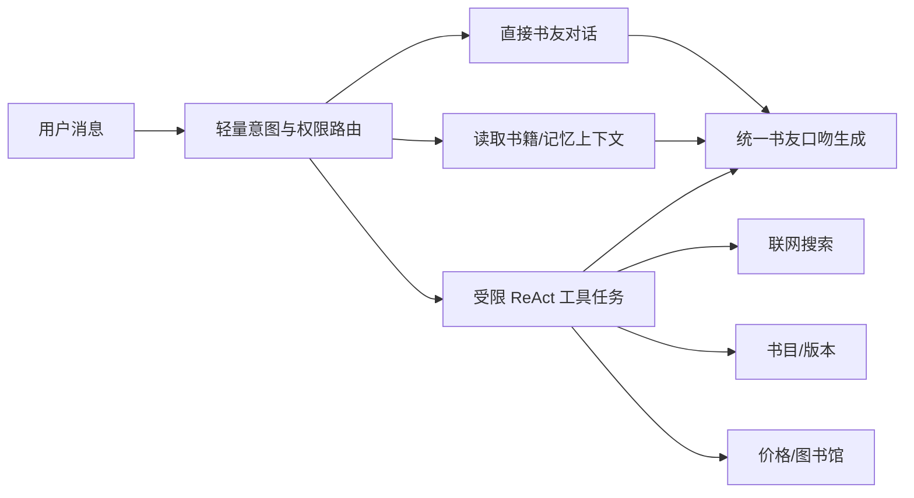

# AI 书友平台：双模式、长上下文与开放生态重审

> 2026-08-17 后续修订：本文关于双模式、搜索边界和 Agent Kit 的判断继续有效；交付形态已进一步调整为 BookMate Local 本地优先开源版。单容器、模型可替换和本地知识库的实现以《AI书友平台_本地优先开源架构方案》为准，未来托管网页是可选云服务，不再是普通用户获得完整界面的唯一方式。

> 版本：v1.0  
> 日期：2026-08-17  
> 本文目的：依据“是否选择书籍”重构 Role、记忆、搜索和 Agent，并重新确定闭源网页与开源 MCP/Skill 的边界。

## 0. 结论

你的新判断总体成立，而且比“先收集大量书籍做 RAG 平台”更贴近当前模型能力：

1. 用户选择书籍后，进入该书专属的讨论空间，加载此书 Role、这本书的对话历史和单书记忆；
2. 用户没有选择书籍时，进入综合书友模式，可以跨书、聊阅读、识别书籍和做推荐；
3. 大部分思想交流依靠模型已有知识、长上下文和关系记忆即可完成，不应默认联网搜索；
4. 联网搜索由用户开关控制，Agent 只判断“搜索是否会显著改善回答”，不能越过用户权限；
5. 只有确实需要多步查证的问题才进入 ReAct 工具循环，普通聊天不应被 Agent 化；
6. 面向普通用户提供低门槛的托管网页产品，可以闭源；
7. 面向开发者和高级用户开源 Agent Spec、MCP Server、Skill、记忆协议和本地文件适配器，不开源版权数据；
8. 如果开源部分离开闭源服务器就完全不能工作，它只是一个开放 SDK，不是有独立价值的开源项目。

最推荐的项目定义是：

> **BookMate 是一个双模式个人书友：选书时，它成为理解该书和双方历史的专属书友；未选书时，它成为综合、跨书的长期阅读伙伴。官方网页提供最完整的托管体验；开放的 BookMate Agent Kit 让任何兼容 MCP/Skills 的宿主拥有同样的基础书友能力。**

## 1. 对原方案的再次修正

### 1.1 不再把自建书库和 RAG 当作产品前提

现代模型对于知名作品、常见主题、作者背景和思想讨论已经有较强基础知识。用户只是想聊“为什么《局外人》让我不舒服”时，先检索十段原文通常不会让对话更好，反而增加延迟、成本和工具感。

因此应从：

```text
用户问题 -> 一律检索书库 -> 生成回答
```

改成：

```text
用户问题
  -> 直接凭模型知识和关系上下文交流
  -> 只有需要精确文本、冷门/新书、版本差异或最新事实时才取证
```

这里的变化不是“RAG 已经过时”，而是把 RAG 从产品中心降为证据工具。产品中心是 Role、长期关系和对话质量。

### 1.2 搜索与书籍上下文必须分开

用户说“不需要搜索”通常指不想联网查网页，但平台仍可能需要读取：

- 用户当前选择的书籍元数据；
- 这本书的历史会话和单书记忆；
- 用户主动上传的 EPUB/PDF；
- 用户自己的标注和摘录。

这些属于**本地/书内上下文**，不是联网搜索。产品界面应把两者明确区分：

- `使用书籍上下文`：选书后默认开启；
- `联网补充`：用户可关闭、询问后使用或允许自动使用。

否则用户关闭“搜索”后，系统可能连自己上传的书也不读，或者用户以为没有联网，Agent 却偷偷调用了网页搜索。

### 1.3 Role 不应等于每本书换一个完全不同的人格

如果《局外人》里叫泊舟、说话克制，换到《百年孤独》就变成另一个毫无共同历史的人，用户很难形成“我的书友”关系。推荐采用三层 Role：

```text
Base Companion Identity
  稳定身份、相处原则、透明边界、全局用户偏好

Mode Role
  ├─ Book Room Role：围绕当前书共同思考
  └─ General Companion Role：跨书交流、找书和推荐

Scoped Context & Memory
  当前书内容、版本、单书记忆、会话线索或跨书阅读记忆
```

书籍会改变它此刻关注什么、调取什么记忆和采用什么体裁策略，但不会把它变成完全不同的人。

## 2. 双模式产品模型

### 2.1 模式 A：选书后的专属书友

触发条件：用户明确选择一个 `work_id`，必要时再选择 `edition_id`。

主要职责：

- 理解这本书的主题、结构、人物、论证和常见争议；
- 加载用户与这本书有关的历史讨论；
- 记得双方对这本书形成的观点、分歧和未完成问题；
- 根据文学、哲学、历史、社科等体裁切换讨论策略；
- 需要时读取用户上传的书籍或摘录；
- 只有用户允许且问题需要时才联网补充；
- 用户退出书房时，把允许跨书使用的信号候选交给用户确认。

Book Room Role 示例：

```text
你是用户在《局外人》书房中的个人书友。
你熟悉当前作品以及你们过去关于它的共同线索。
你的首要任务不是总结作品，而是理解用户此刻的思想并共同推进。
对精确原句、版本措辞和不确定事实保持诚实；没有证据时不要伪造。
联网搜索受 search_policy 约束，绝不能越过用户选择。
```

### 2.2 模式 B：未选书的综合书友

触发条件：没有 `active_book_id`。

主要职责：

- 接受跨书、作者、阅读体验、生活和思想话题；
- 帮用户想起“那本记不清名字的书”；
- 将不同作品放在一起比较；
- 根据长期阅读偏好推荐下一本；
- 帮用户判断当前话题是否值得进入某本书房继续；
- 可以讨论一本书，但只有用户确认后才把它设为当前书籍；
- 最新出版、奖项、价格、馆藏等动态问题按搜索策略处理。

General Companion Role 不是百科问答模式。它仍然保持个人书友的倾听、分歧和关系连续性，只是知识作用域从单书变成跨书。

### 2.3 模式切换

| 当前状态 | 用户动作 | 结果 |
|---|---|---|
| 综合书友 | 选择《局外人》 | 进入该书房，加载单书记忆和书籍上下文 |
| 综合书友 | 直接聊《局外人》但未选择 | 可以回答；轻提示“要把它设为当前书籍吗” |
| 书籍模式 | 谈到另一部作品 | 可以比较，不自动切换当前书 |
| 书籍模式 | 明确说“我们聊《悉达多》” | 二次确认后切换书房 |
| 书籍模式 | 退出当前书 | 回到综合书友，保留全局允许的关系记忆 |
| 任一模式 | 搜索关闭 | Agent 不得联网，必要时说明知识边界 |

切换不应清空短期会话。用户可以从一本书自然聊到另一本，但长期记忆写入时必须正确归属。

## 3. 记忆作用域

### 3.1 四层记忆

| 层级 | Key | 内容 | 默认使用范围 |
|---|---|---|---|
| 会话记忆 | `conversation_id` | 最近轮次和当前命题 | 当前会话 |
| 单书记忆 | `user_id + work_id` | 对本书的观点、分歧、未完成问题 | 该书房 |
| 全局书友记忆 | `user_id` | 相处方式、长期阅读兴趣、跨书主题 | 两种模式 |
| 原始内容上下文 | `asset_id/edition_id` | 上传文件、摘录、合法书籍内容 | 受内容 ACL 限制 |

### 3.2 记忆提升规则

单书记忆不应自动全部进入全局记忆。例如用户在《局外人》里谈到某次家庭经历，不代表以后每次推荐都应使用它。

建议流程：

1. 对话中产生单书记忆候选；
2. 默认只写入当前 `work_id`；
3. 系统认为其可能是长期偏好时，提出全局记忆候选；
4. 用户确认后才提升；
5. 用户可以选择“只在这本书里记得”；
6. 删除单书记忆时，检查是否存在由它提升的全局记忆并提示联动删除。

### 3.3 Role 与记忆装配

每轮请求装配而不是复制一个巨大 system prompt：

```json
{
  "base_identity": "companion_v3",
  "mode": "book_room",
  "active_book": {"work_id": "...", "edition_id": null},
  "conversation_policy": {"depth": "deep", "pace": "short"},
  "search_policy": "ask",
  "global_memories": ["..."],
  "book_memories": ["..."],
  "content_sources": ["model_knowledge", "user_upload"],
  "current_thread": "..."
}
```

这样可以独立测试：是基础身份出了问题、模式 Role 错了、记忆取错了，还是工具决策不对。

## 4. 充分利用 LLM 能力，而不是重复造基础模型

### 4.1 模型已有知识可以承担什么

对于广为人知、出版时间较早的作品，模型通常可以承担：

- 无需精确引文的主题讨论；
- 人物动机和常见解释；
- 作者及思想背景的大致介绍；
- 与其他经典作品的比较；
- 根据用户观点生成反方和追问；
- 综合书友模式下的广泛书籍推荐候选。

这正是项目成立的技术窗口：无需训练一个“读过所有书”的自有模型，就能先把 Role、记忆、心流和工具边界做成产品。

### 4.2 “模型能聊一本书”不等于“模型拥有这本书”

仍然必须客观看待以下边界：

- 冷门书、新出版书、小语种作品可能几乎没有可靠参数知识；
- 同一作品不同译本的措辞、章节和页码容易混淆；
- 模型可能熟悉剧情和评论，却会伪造看似真实的原句；
- 用户上传整本书之前，模型无法读取用户手中的具体版本；
- 长上下文解决的是“给了内容以后如何使用”，不解决内容从哪里合法获得；
- 整本书每轮重复发送会产生显著成本和延迟。

因此产品需要按置信层级表达：

| 层级 | 上下文来源 | 可以承诺什么 |
|---|---|---|
| L0 | 仅模型已有知识 | 思想交流；不承诺精确引文和版本 |
| L1 | 书目元数据和用户摘录 | 能围绕摘录精读，书外部分仍有限 |
| L2 | 用户上传/授权全文 | 能检索和定位当前版本 |
| L3 | 联网资料 | 能补充最新讨论和外部事实，必须标来源日期 |

UI 可以用轻量状态表示“凭已有知识交流”“已读入你的版本”“已联网补充”，而不是把 RAG 术语暴露给普通用户。

### 4.3 长上下文优先，但保留局部取证

一本书可能可以放进现代模型的上下文窗口，但不代表每轮都应该如此做。推荐策略：

1. 短书或当前章节可直接放入长上下文；
2. 完整书籍使用 provider prompt caching 或服务端上下文缓存；
3. 对话先凭当前上下文直接进行；
4. 精确原句、跨章节证据或上下文预算不足时，使用本地章节检索；
5. 书内检索对用户透明，不等同于联网搜索；
6. 不为了“使用了 RAG”而每轮强制检索。

因此技术表述应从“RAG-first”改为 **Context-first, retrieval-when-needed**。

## 5. 搜索开关和意图识别

### 5.1 推荐使用三态策略

简单布尔开关容易产生困惑。推荐默认展示一个简洁“联网补充”入口，内部支持三态：

| 策略 | 用户含义 | Agent 行为 |
|---|---|---|
| `off` | 不联网 | 永远不调用网页搜索；说明可能过时或未知 |
| `ask` | 需要时问我 | Agent 判断搜索有明显价值时先请求一次授权 |
| `auto` | 需要时自动 | 只在明确的动态/外部事实问题中自动搜索并显示来源 |

默认建议 `ask`。这既保护心流和隐私，也让用户知道为什么突然要离开书本去查网页。

### 5.2 哪些意图通常不需要搜索

- 用户表达读后感；
- 讨论人物、主题、结构或道德困境；
- 希望得到反方观点；
- 将书与个人生活连接；
- 模型熟悉的经典作品之间比较；
- 基于已有偏好做第一轮推荐；
- 对用户提供的摘录进行精读。

### 5.3 哪些意图应建议或自动搜索

- “最近一年人们如何重新评价这本书”；
- 新书、冷门书或模型明确不熟悉的作品；
- 最新奖项、出版、作者动态；
- 价格、库存、附近图书馆和可借状态；
- 要求准确采访、论文或新闻来源；
- 用户明确说“帮我查一下”；
- 模型发现关键事实置信度不足，且搜索能被验证。

### 5.4 搜索决策不能越过用户权限

```python
if search_policy == "off":
    answer_without_web_or_state_limit()
elif user_explicitly_requests_search:
    search()
elif intent.requires_fresh_external_facts:
    if search_policy == "auto":
        search()
    else:
        ask_for_search_permission()
else:
    answer_directly()
```

Agent 的“是否需要搜索”只是建议权，用户开关才是最终授权。

## 6. ReAct Agent 应该用在哪里

### 6.1 不应让每轮聊天都进入 ReAct

经典 ReAct 会在“思考—行动—观察”之间循环，适合不确定的多步任务，但私人书友的大部分消息只需要直接交流。如果每句话都先规划和调用工具，会产生：

- 首 token 延迟；
- 不必要的搜索和费用；
- 机械化、研究报告式回答；
- 更大的提示注入面；
- 难以保持对话节奏；
- 工具失败破坏本来可以直接完成的交流。

### 6.2 推荐两级 Agent



第一级每轮都运行，但只输出结构化决策：

```json
{
  "mode": "book_room",
  "intent": "personal_interpretation",
  "needs_book_context": true,
  "web_search_value": "low",
  "tool_plan": [],
  "conversation_move": "mirror_then_tension"
}
```

第二级只在确实需要多步工具时运行，并设置最大步数、成本和超时。

### 6.3 意图集合保持小而稳定

MVP 推荐：

- `personal_reflection`：读后感和人生连接；
- `book_interpretation`：人物、主题、论证；
- `exact_text`：原句、章节、版本；
- `cross_book`：跨作品比较；
- `recommendation`：推荐下一本；
- `identify_book`：寻找记不清的书；
- `fresh_external`：最新讨论或动态事实；
- `commerce_library`：价格和馆藏；
- `other`：普通综合书友话题。

不要在 MVP 设计几十个细粒度意图，否则分类误差和维护成本会超过收益。

## 7. 闭源网页与开源项目的正确关系

### 7.1 两类用户、两种交付物

| 用户 | 真实需求 | 交付方式 |
|---|---|---|
| 普通读者 | 注册后立即使用，不懂模型、MCP、Docker | 官方托管网页/PWA，产品代码可闭源 |
| 开发者/高级用户 | 在自己的 Agent、IDE、桌面客户端或本地模型中使用 | 开源 BookMate Agent Kit |

MCP 和 Skills 并不能解决普通用户“不懂技术”的问题。它们解决的是跨宿主复用和开发者集成。普通用户仍然需要网页、移动端或一键安装客户端。

### 7.2 建议不要再称“整个平台开源”

如果网页、账户、托管记忆、推荐运营和商业数据都闭源，更准确的对外表述是：

> **闭源托管产品 + 开放协议和开源 Agent Kit。**

这并不比“全部开源”差，关键是透明。如果宣传为开源平台，用户下载后却只能调用闭源服务器，会损害开发者信任。

### 7.3 开源部分必须能独立产生价值

开源真实性可以用一个问题检验：

> 不连接 BookMate 官方服务器，一个用户能否用自己的模型、自己的书籍文件和本地存储，获得基本的双模式书友体验？

推荐答案必须是“可以”。允许体验较基础，但不能完全不可用。

## 8. BookMate Agent Kit 设计

### 8.1 开源组件

```text
packages/agent-kit/
├─ spec/
│  ├─ companion-role.md        # 基础身份与双模式规范
│  ├─ memory.schema.json       # 全局/单书/会话记忆
│  ├─ search-policy.schema.json
│  └─ response.schema.json
├─ mcp-server/
│  ├─ tools/                   # 选书、上下文、记忆、推荐
│  ├─ resources/               # 当前书、书房历史、用户文件
│  └─ storage/                 # SQLite/本地文件适配器
├─ skills/
│  ├─ codex/                   # Codex Skill 包
│  └─ generic/                 # 可移植的 prompt/workflow 说明
├─ connectors/
│  ├─ local-epub/
│  ├─ local-pdf/
│  ├─ openlibrary/
│  └─ model-gateways/
├─ evals/
│  ├─ role-consistency/
│  ├─ search-routing/
│  └─ memory-scope/
└─ examples/
   └─ public-domain-books/
```

### 8.2 MCP 负责什么

MCP 更适合暴露结构化能力和资源，而不是单独承担全部人格：

建议工具：

```text
select_book(query_or_id)
clear_active_book()
get_active_book()
get_book_context(question, scope)
list_book_memories(work_id)
propose_memory(scope, content, source)
save_memory(candidate_id)
delete_memory(memory_id)
recommend_books(intent, signals, limit)
search_web(query, reason)              # 必须受 host/user 权限控制
```

建议资源：

```text
bookmate://companion/profile
bookmate://reader/preferences
bookmate://books/{work_id}
bookmate://books/{work_id}/threads
bookmate://conversations/{id}/summary
```

MCP 的优势：工具结构明确、宿主可决定是否批准调用、数据可以留在本地、不同 Agent 宿主能够复用。

MCP 的限制：它不会自动保证宿主模型采用同样的书友语气、记忆策略和搜索克制；人格行为仍需要 Skill/system instructions 或宿主侧 Agent 实现。

### 8.3 Skill 负责什么

Skill 更适合表达过程知识：

- 如何判断选书/未选书模式；
- 如何装配当前书 Role；
- 如何先接住用户再决定是否查证；
- 如何调用 MCP 记忆而不越过作用域；
- 如何执行 `off/ask/auto` 搜索策略；
- 如何保持一个主问题和稳定书友身份；
- 如何在回答后提出记忆候选；
- 如何生成延续、反面、跨越三路推荐。

但 Skills 不是跨所有 LLM 产品的统一标准。应维护一个厂商中立的 Agent Spec，再为具体宿主生成适配包，避免把整个开源项目绑定在某一个 Skill 格式上。

### 8.4 MCP 与 Skill 不是二选一

| 能力 | MCP | Skill/Agent instructions |
|---|---:|---:|
| 读取本地书籍 | 强 | 弱 |
| 结构化记忆 CRUD | 强 | 只描述流程 |
| 搜索权限和工具调用 | 提供工具/审批点 | 决定何时建议调用 |
| 稳定书友身份 | 不足 | 强 |
| 双模式行为 | 提供状态 | 强 |
| 跨宿主可移植性 | 相对强 | 需逐宿主适配 |
| 独立运行 | 需要宿主 | 需要宿主/Agent |

最佳组合是：**Agent Spec 定义行为，Skill 教宿主如何执行，MCP 提供数据、记忆和工具。**

## 9. 数据很难开源时怎么办

### 9.1 开源代码、协议和适配器，不开源受限内容

可以开源：

- 双模式 Role 规范；
- 记忆 schema 和本地 SQLite 实现；
- EPUB/PDF 本地读取；
- 公版书示例；
- Open Library 等开放元数据连接器；
- 搜索策略、工具协议和评测集；
- 用户自带模型 Key 的网关；
- 一键本地运行示例。

不应开源或不能开源：

- 未授权版权书全文；
- 用户私人会话和阅读记忆；
- 需要商业合同的书目、价格和馆藏数据；
- 托管服务密钥；
- 出版社授权内容转储。

### 9.2 Bring Your Own Book

开源版最自然的数据策略是 BYOB：

- 用户选择模型本来就熟悉的书，可以直接交流；
- 用户需要具体版本时，加载自己合法持有的 EPUB/PDF；
- 文件默认留在本地 MCP Server；
- 宿主只获取回答所需的上下文；
- 用户可以完全关闭联网；
- 公版书作为演示和测试数据。

这既绕开数据无法再分发的问题，也形成强隐私卖点。

### 9.3 托管网页的增强价值

闭源网页可以提供开源版本之外的便利：

- 无需安装的账户和跨设备同步；
- 模型费用代付和自动路由；
- 更稳定的长期记忆、备份和导出；
- 合法授权的数据和商业连接器；
- 更好的 UI、语音、移动端和安全运营；
- 经过真实用户反馈持续优化的 Role 与评测；
- 客服、内容下架和机构合规。

商业价值来自托管质量和合法合作，而不是故意把开源版做残。

## 10. 推荐的开源/闭源边界

| 层 | 建议 | 原因 |
|---|---|---|
| Agent Spec | 开源 | 建立生态标准和信任 |
| MCP Server 基础版 | 开源 | 本地数据与多宿主兼容的核心价值 |
| Codex/通用 Skill | 开源 | 降低安装和使用门槛 |
| 本地 EPUB/PDF/SQLite | 开源 | 让项目脱离官方服务器也能工作 |
| 公版示例与基础评测 | 开源 | 可验证、可贡献 |
| 官方网页前端 | 闭源可接受 | 面向普通用户的产品差异和迭代速度 |
| 托管 Agent 编排 | 可闭源 | 模型路由、安全、成本与运营能力 |
| 高级评测与线上反馈数据 | 闭源 | 用户隐私和商业积累 |
| 授权书籍/商家/馆藏数据 | 闭源或仅连接 | 合同和版权限制 |
| 连接器 SDK | 开源 | 促进第三方生态 |

许可证建议：Agent Spec、SDK、Skills 使用 Apache-2.0；MCP Server 可同样使用 Apache-2.0 以最大化集成。商标和官方托管服务独立声明。不要用模糊的“源码可见但禁止使用”冒充开源许可证。

## 11. 调整后的 MVP

### 11.1 托管网页 MVP

P0：

- 一个稳定基础书友；
- 明确的“综合书友 / 当前书房”双模式；
- 搜索或选择一本书；
- 模型已有知识直接交流；
- 全局、单书、会话三级记忆；
- 联网补充 `off/ask/auto`；
- 轻量意图路由；
- 用户明确要求时再使用受限 ReAct；
- 推荐下一本；
- 透明显示当前依据：已有知识、用户文件或联网来源。

P1：

- 用户上传 EPUB/PDF；
- 长上下文缓存和书内局部取证；
- 版本选择和精确引用；
- 语音输入；
- 多设备记忆；
- 最新讨论、价格和馆藏工具。

这一路线比先建大规模公共书库更快验证核心价值。

### 11.2 开源 MVP

建议不要与托管网页同一天追求完整。先发布：

1. `bookmate-agent-spec` v0.1；
2. 本地 SQLite 记忆和 active book 状态；
3. 一个 MCP Server，支持选书、记忆和本地 EPUB/PDF；
4. 一个 Codex Skill 和一份通用 instructions；
5. 3～5 本公版示例；
6. 双模式、搜索权限和记忆隔离测试；
7. 5 分钟 Quick Start。

开源版不需要复刻官方网页 UI。

## 12. 商业与护城河重审

### 12.1 如果模型已经很强，产品价值在哪里

这正是本项目最重要的问题。用户也可以直接打开任意通用聊天产品说“和我聊《局外人》”。平台必须提供通用对话框没有稳定做到的组合：

- 自动进入正确的书籍 Role；
- 按书隔离又能合理提升的长期记忆；
- 稳定、可识别的个人书友身份；
- 用户可控搜索和可信来源状态；
- 跨日恢复共同线索；
- 基于长期理解而不是单轮 prompt 的推荐；
- 书籍文件、MCP 和不同模型之间的可迁移性；
- 普通用户无需配置即可获得上述体验。

你的机会不是“模型不知道书”，而是“模型能力很强，但普通用户不会持续配置 Role、上下文、记忆和工具边界”。

### 12.2 真正的护城河

- 经过大量真实对话调优的 Role 和心流策略；
- 记忆的作用域、提升、纠错和删除体验；
- 搜索克制与工具路由评测；
- 用户跨书思想图谱和推荐反馈，但必须保护隐私；
- 简洁、无技术负担的网页体验；
- 开源 MCP/Skill 形成的开发者分发；
- 合法内容和图书馆/商家合作；
- 品牌：用户愿意把它认作“我的书友”。

仅有一个 prompt、一个 MCP Server 或一个聊天网页都不构成长期壁垒。

## 13. 必须保留的客观怀疑

### 13.1 模型原生产品可能很快覆盖功能

通用模型会持续增强 Projects、Memory、文件和搜索。如果 BookMate 只提供“选书 + system prompt”，很容易被吸收。必须在关系体验、书籍记忆模型、开放可迁移性和推荐上做得显著更好。

### 13.2 Skill 的分发范围有限

不同宿主对 Skill、系统提示、记忆和 MCP 的支持并不一致。不能把“提供一个 Skill”理解成一次开发、全球所有 LLM 用户都能无缝使用。Agent Spec 必须厂商中立，并准备多个适配层。

### 13.3 MCP 面向的首先是技术用户

MCP 能扩大开发者生态，但不会直接解决普通读者获客。网页产品仍需独立证明需求、留存和付费。

### 13.4 数据不开源会限制部分能力

没有版权全文，开源版对冷门书和精确引文只能依靠 BYOB。必须坦率说明，不要暗示模型“读过所有版本”。

### 13.5 搜索开关会产生正确性与体验冲突

用户关闭搜索时仍可能问最新事实。系统要尊重关闭并明确知识截止/不确定性，不能为了答案完整偷偷联网。

### 13.6 Role 过多会稀释身份

可以按书和体裁调整关注点，但不要为每本书生成一个夸张人格。先证明“一位基础书友 + 两种模式 + 体裁策略”足够。

## 14. 新的关键决策

### ADR-007：双模式而不是强制先选书

没有选择书籍时仍可与综合书友交流；选书只是缩小知识、记忆和 Role 的作用域。

### ADR-008：Context-first, retrieval-when-needed

优先使用模型已有知识、当前会话、关系记忆和可缓存的长上下文；精确取证时才检索，不把 RAG 作为每轮强制步骤。

### ADR-009：联网搜索由用户策略最终授权

Agent 判断搜索价值，但 `off/ask/auto` 决定能否调用。默认 `ask`。

### ADR-010：ReAct 只处理受限的多步工具任务

思想交流直接回答；动态事实、找书、价格和馆藏等任务才进入有步数与成本限制的工具流程。

### ADR-011：闭源托管产品 + 开源 Agent Kit

官方网页面向普通用户并可闭源；Agent Spec、MCP、Skills、本地书籍和记忆基础设施开源，且不依赖官方服务也能基本工作。

### ADR-012：数据采用 BYOB 与连接器，不随代码分发受限语料

开源项目提供数据结构、读取器、开放元数据和公版样例；用户或合作方负责合法内容来源。

## 15. 推荐实施顺序

1. 先在网页原型中实现“综合书友 / 当前书房”显式切换；
2. 把记忆拆成全局、单书、会话三个作用域；
3. 增加 `off/ask/auto` 联网策略和 8 类轻量意图；
4. 用 30～50 个真实问题验证哪些对话根本不需要搜索/RAG；
5. 接入一个真实长上下文模型，先依靠已有知识交流；
6. 再增加用户本地文件和精确取证；
7. 稳定协议后抽取 `bookmate-agent-spec`；
8. 发布本地 MCP Server + Codex Skill + 公版样例；
9. 最后扩展价格、图书馆和商业数据连接器。

## 16. 最终判断

这次方向修正降低了项目最重、最难开源的部分：不再要求先收集全球书籍数据，也不再默认每轮搜索或 RAG。它把模型已经拥有的强能力当作基础，把产品精力集中到普通模型聊天仍然没有自然解决的部分：

> **Role 的正确切换、按书隔离的共同记忆、跨书连续关系、用户可控的搜索，以及一个无需技术配置就能真正长期相处的书友。**

对于开源，最有价值的不是公开一份数据，而是公开一种可迁移的“书友能力协议”。MCP 让数据和工具可接入，Skill 让宿主知道如何成为书友，Agent Spec 保证两者不会被某一家模型格式锁定。托管网页则把这些复杂性藏起来，服务真正不懂技术的读者。

这会形成一个更清晰的双飞轮：

```text
托管网页：普通用户 -> 真实对话反馈 -> 更好的 Role/评测/体验
开放生态：开发者宿主 -> 更多连接器与使用场景 -> 更强分发和协议影响力
```

二者共享行为规范和兼容协议，但不必共享受限数据、完整网页代码或商业运营系统。

## 17. 官方兼容资料入口

OpenAI Docs 在当前网络环境中返回 403，本文不据此声称具体客户端版本或可用性；实现前应在目标环境重新核验：

- [Codex Skills](https://developers.openai.com/codex/skills)
- [Codex MCP](https://developers.openai.com/codex/mcp)
- [OpenAI API Documentation](https://developers.openai.com/api/docs/)
- [Model Context Protocol Specification](https://modelcontextprotocol.io/specification/2025-06-18)
